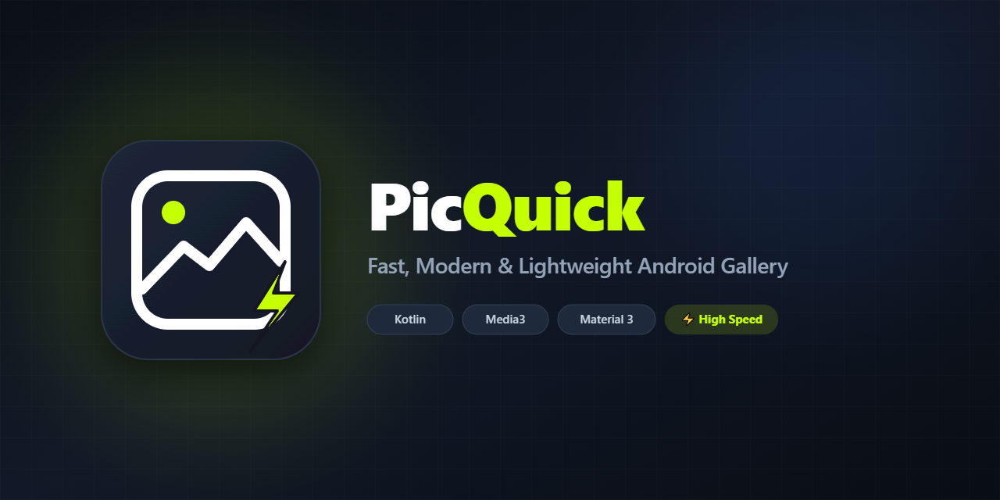

**English | [Русский](README.md)**

# PicQuick

  

**PicQuick** is a fast and lightweight offline gallery for Android in the spirit of classic QuickPic. The app is designed for local viewing of photos and videos without ads, cloud sync, or analytics.

> This repository is the official public release page for PicQuick. The source code is not published here.

## Official Download

The latest stable version is available in the [Releases](../../releases/latest) section.

## App Details

| Parameter | Value |
|---|---|
| Developer | **QANAVERAL** |
| Package name | `qanaveral.picquick` |
| Current version | `1.1.4` |
| Version code | `450` |
| Requires Android | Android 7.0 and above |
| Operation mode | Local offline gallery |

## Features

PicQuick displays local photos and videos by folder, supports sorting, hidden albums, manual ordering, multi-select, renaming, file sharing, and deletion. The built-in player can resume playback from a saved position, supports subtitles and audio tracks. It has Russian and English interfaces.

The app contains no ads, cloud sync, analytics, or trackers.

## Screenshots 📸

Expand screenshots (12 items)

 

| | | |
|---|---|---|
|  |  |  |
|  |  |  |
|  |  |  |
|  |  |  |

## Installation

1. Open the [Releases](../../releases/latest) page.
2. Download the APK from the **Assets** subsection.
3. If necessary, allow your browser or file manager to install apps from this source.
4. Install the APK.

## Verifying the downloaded APK

Each release includes a `*.sha256` file. It allows you to verify that the APK was downloaded without corruption. Compare the SHA-256 only with the file from the same release.

## Important about releases

* Only APKs published in the **Releases** section of this repository are official.
* A separate Release with a new version number is created for each update.
* External mirrors, modifications, and repackaged APKs are not supported.

## Contacts and authorship

Author and releaser: **QANAVERAL**.

4PDA thread: [PicQuick](https://4pda.to/forum/index.php?showtopic=1125242#entry144703437).

---

## 💰 Support the developer

If PicQuick was useful — you can toss a coin for gas for my old Opel Corsa. It's old but still runs, just like me.

👉 **[Donate](https://donationalerts.com/r/qanaveral)** ❤️

---

© 2026 QANAVERAL. PicQuick.
