# PicQuick

**PicQuick** — быстрая и лёгкая офлайн-галерея для Android в духе классического QuickPic. Приложение предназначено для локального просмотра фото и видео без рекламы, облачной синхронизации и аналитики.

> Этот репозиторий — официальная публичная страница релизов PicQuick. Исходный код приложения здесь не публикуется.

## Официальная загрузка

Актуальная стабильная версия доступна в разделе [Releases](../../releases/latest).

## Сведения о приложении

| Параметр | Значение |
|---|---|
| Разработчик | **QANAVERAL** |
| Имя пакета | `qanaveral.picquick` |
| Текущая версия | `1.1.4` |
| Версия кода | `450` |
| Требуется Android | Android 7.0 и выше |
| Модель работы | Локальная офлайн-галерея |

## Возможности

PicQuick показывает локальные фото и видео по папкам, поддерживает сортировку, скрытые альбомы, ручной порядок, мультивыбор, переименование, обмен файлами и удаление. Встроенный плеер умеет продолжать просмотр с сохранённой позиции, работать с субтитрами и аудиодорожками. Имеет русский и английский интерфейсы.

Приложение не содержит рекламы, облачной синхронизации, аналитики и трекеров.

## Скриншоты 📸

Развернуть скриншоты (12 штук)

 

  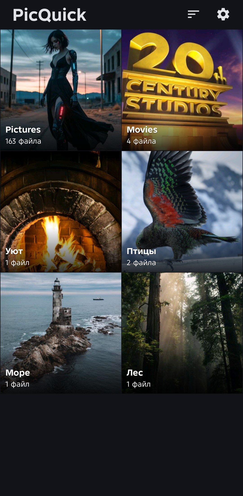
  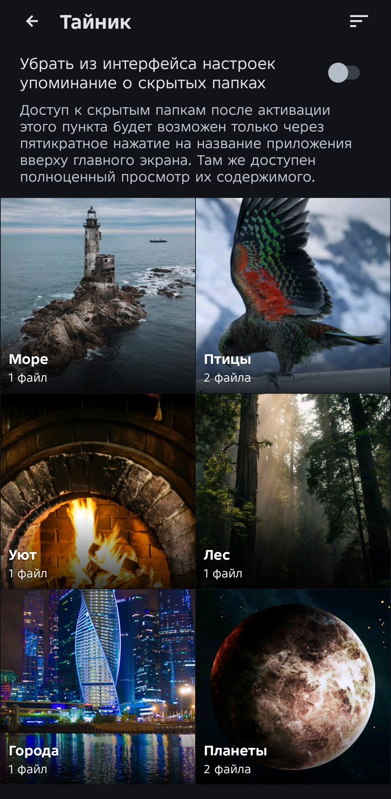
  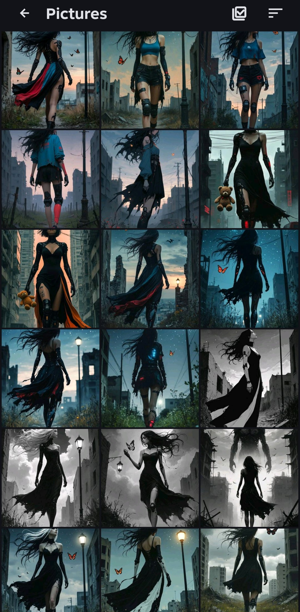
  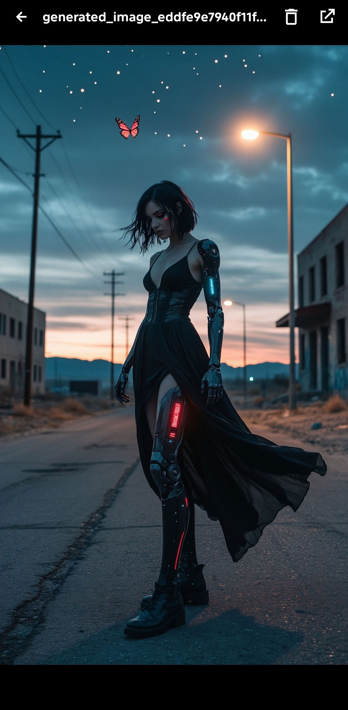
    
  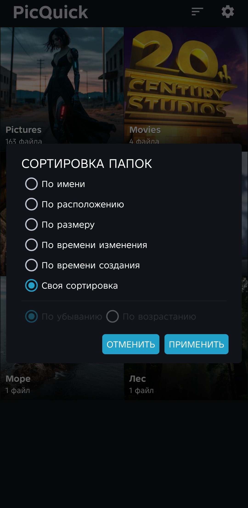
  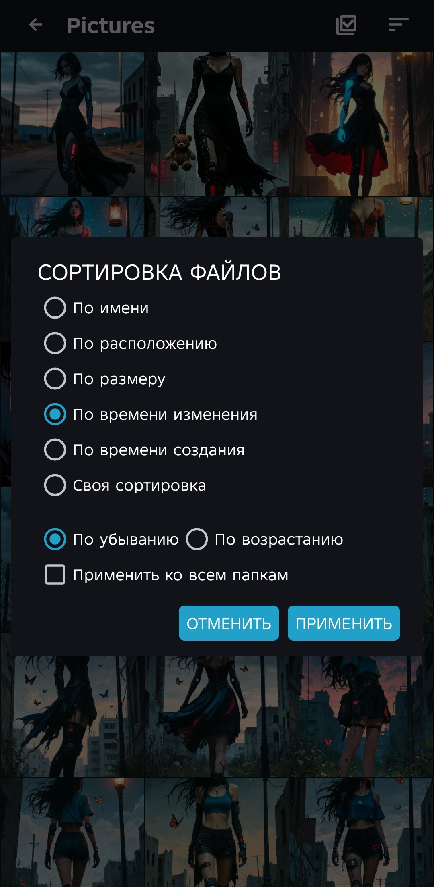
  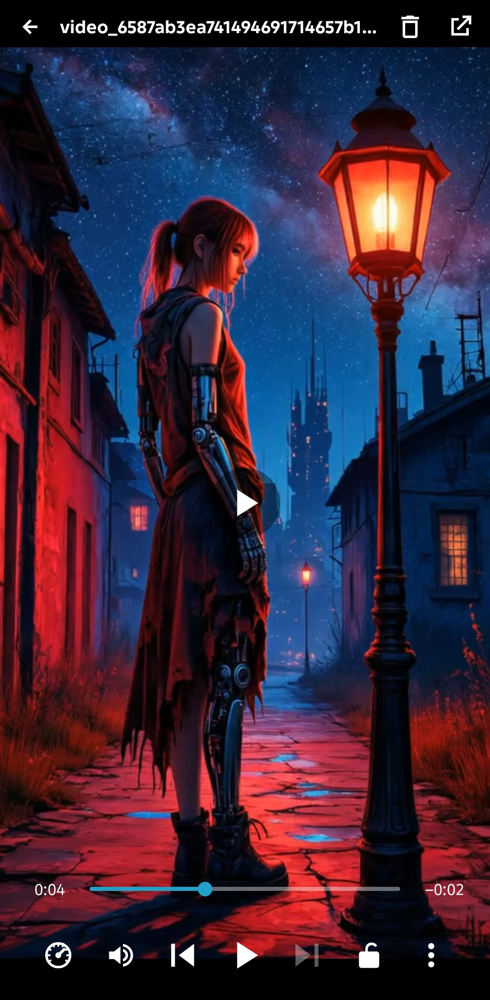
  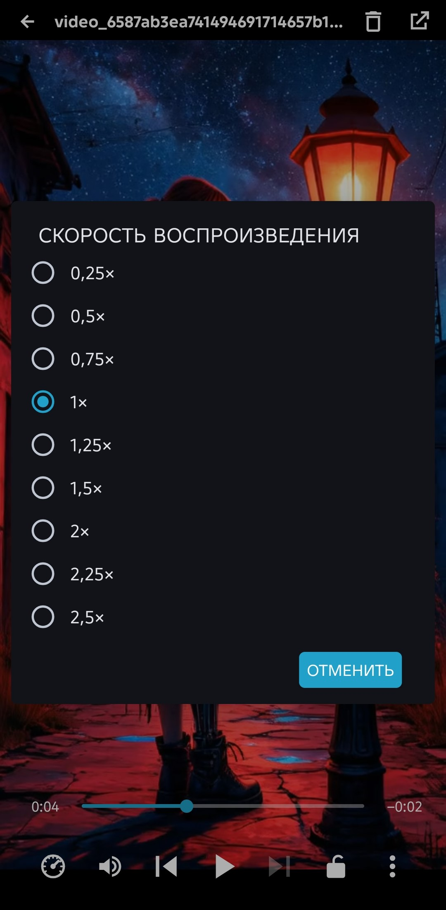
    
  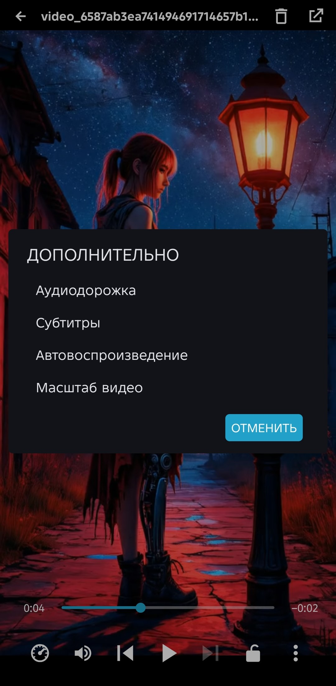
  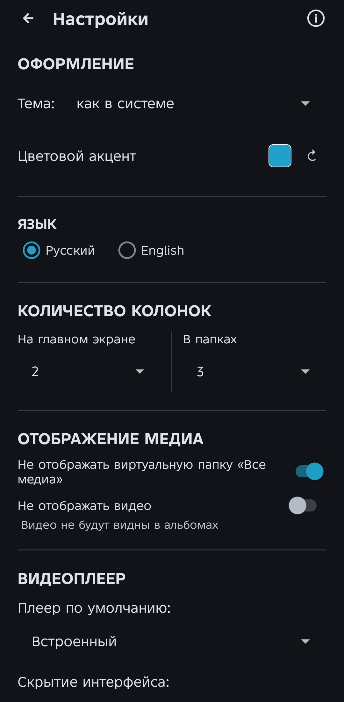
  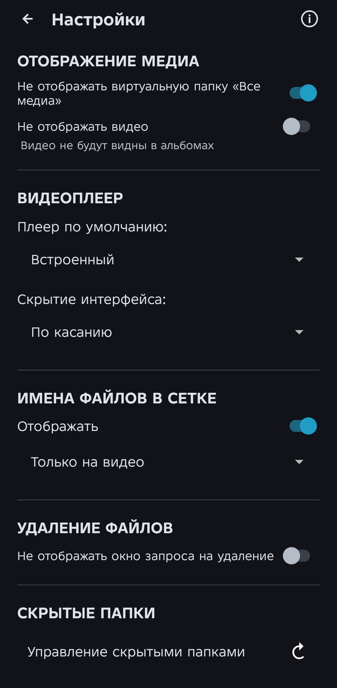
  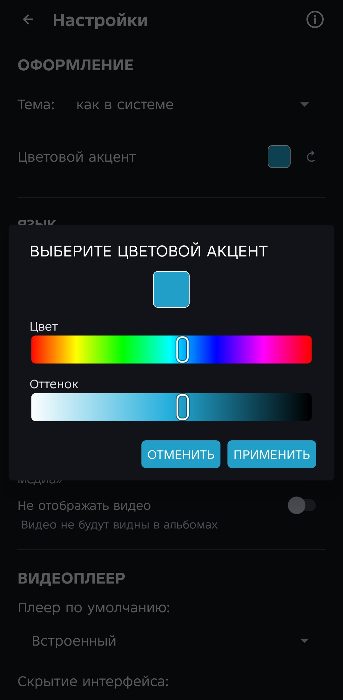

## Установка

1. Откройте страницу [Releases](../../releases/latest).
2. Скачайте APK из раздела **Assets**.
3. При необходимости разрешите браузеру или файловому менеджеру установку приложений из этого источника.
4. Установите APK.

## Проверка загруженного APK

К каждому релизу приложен файл `*.sha256`. Он позволяет проверить, что APK был скачан без искажений. Сверяйте SHA-256 только с файлом из того же Release.

## Важное о релизах

* Официальными являются только APK, опубликованные в разделе **Releases** этого репозитория.
* Для каждого обновления создаётся отдельный Release с новым номером версии.
* Внешние зеркала, модификации и перепакованные APK не поддерживаются.

## Контакты и авторство

Автор и релизер: **QANAVERAL**.

Тема на 4PDA: [PicQuick](https://4pda.to/forum/index.php?showtopic=1125242#entry144703437).

---

## 💰 Поддержать разработчика

Если PicQuick пригодился — можешь кинуть на бензин для моей Opel Corsa. Она старая, но ещё ездит, как и я.

👉 **[Задонатить](https://donationalerts.com/r/qanaveral)**❤️

---

© 2026 QANAVERAL. PicQuick.
